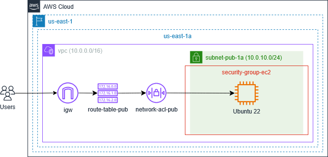

# Terraform Scripts to Create a Secure EC2 Instance on AWS 
Terraform and AWS User Data Bash scripts that create a secure VPC and EC2 instance on AWS. Installs and configures automatic updates, SSH, firewalls, security modules, and Fail2ban. Includes User Data scripts for Ubuntu 22 and Amazon Linux 2023 (AL2023). 

Shown below is an architectural diagram of the resources created by the ubuntu22.tfvars file located in the root directory. This file provides an example of how to customize the Terraform scripts, creating one EC2 instance. To create an identical infrastructure using an Amazon Linux 2023 instance, refer to the al2023.tfvars file, also located in the root directory.



Before customizing and launching the script, review the resources that will be created, as some resources may not be free tier eligible. Please refer to the [Amazon Pricing](https://aws.amazon.com/pricing/) page for specific regional pricing.  

## Terraform Modules Overview
The root module [main.tf](./main.tf) calls the child modules described below, sending values from the root module .tfvars file and various module outputs.

### `networking` Module
Creates an AWS network infrastructure consisting of a VPC, internet gateway (IGW), NAT gateways, public and private subnets, route tables for each subnet, network access control lists (NACL), and security groups.
### `ec2` Module
Deploys AWS EC2 instances from images listed in datasources.tf, runs an AWS User Data script to apply security measures, and uploads public keys to enable access to each instance.

## AWS User Data Bash Scripts Overview
The AWS User Data Bash script installs and configures the security-related software packages described below. Please note the applicable distribution-specific notes.

|Security Measure|Ubuntu 22|Amazon Linux 2023|
|--------|---------|------|
|Automatic security updates|unattended-upgrades|dnf-automatic|
|SSH user with sudo permissions|ssh_ubuntu|ssh_al|
|sshd_config updates to increase security|-|-|
|Firewall to limit port to custom SSH|UFW|nftables|
|Linux Security Modules|AppArmor|SELinux|
|Fail2ban (with SSH jail)|-|-|

## Getting Started

### Dependencies
+ Terraform (For installation instructions, [click here](https://developer.hashicorp.com/terraform/tutorials/aws-get-started/install-cli).)
+ AWS CLI (For installation instructions, [click here](https://docs.aws.amazon.com/cli/latest/userguide/getting-started-install.html).)
+ Established connection to an AWS account (For CLI configuration instructions, [click here](https://docs.aws.amazon.com/cli/latest/userguide/getting-started-quickstart.html).)

### Installation
To install the script, either clone the [terraform-vpc-ec2-aws](.) repo or download the files to the local host. 

## Usage
Follow the steps outlined below to configure and run the Terraform scripts.

### Step 1. Create the SSH Key Pair
On standard Linux distributions with OpenSSH installed, the command below will create an SSH key pair of type Ed25519 (-t ed25519) in the location (-f ~/.ssh/aws-test-env-ed25519) referenced in the .tfvars file. To use a different key type or location, update the variables file accordingly.

```bash
ssh-keygen -f ~/.ssh/aws-test-env-ed25519 -t ed25519
```

**Note:** The command above should also work for Windows and macOS implementations of OpenSSH.

### Step 2. Configure Terraform Backend
The root `backend.tf` file uses an S3 backend with DynamoDB to store state files and purposely includes placeholder values for the backend attributes, which are read from the `backend.cnf` file. Update the values in `backend.cnf` as necessary if using S3 as a backend. For a discussion of the various Terraform backend configuration options, [click here](https://developer.hashicorp.com/terraform/language/backend).

### Step 3. Customize the .tfvars File
The settings for the AWS networking and EC2 resources are contained in a .tfvars file, which is passed to Terraform at runtime. This file must be customized before provisioning resources with Terraform.

While most of the variables correspond to standard AWS Terraform module attributes, there are some custom variables that require specific attention. In particular, please note the following variables:

+ Project Variables
  + project: Name of the project
  + env: Environment, e.g. Dev, Test, Prod
+ EC2 Module
  + public_key: The location on the local machine of the SSH public key.
  + ami: Reference to the Amazon Machine Image. The module's datasources.tf file contains two possible AMIs, Ubuntu 22 (ubuntu_22) or Amazon Linux 2023 (amazon_linux_2023).
  + ssh_ip: The SSH IPv4 address that will be allowed by OpenSSH, Fail2ban, and the instance firewall. This value must correspond with the SSH IPv4 address allowed by the Security Groups and NACLs. The value is currently set to "0.0.0.0/0" but for increased security should be modified throughout to a more specific address.
  + ssh_port: The SSH port that will be allowed by OpenSSH, Fail2ban, and the instance firewall. This value must correspond with the SSH port allowed by the Security Groups and NACLs. 

### Step 4. Run the Terraform Scripts 
To run the script, follow standard Terraform practices by navigating to the directory that holds the root `main.tf` script, then running the commands to initialize and apply the script. In this case, because the script employs a .tfvars file, the `-var-file` command line option is used.

```bash
terraform init -backend-config="backend.cnf"
terraform plan -var-file="jenkins-ubuntu22.tfvars"
terraform apply -var-file="jenkins-ubuntu22.tfvars"
```

### Step 5. Access the EC2 Instance via SSH
To access the Ubuntu 22 instance, enter the command below in the shell. Change the username to ssh_al if using an Amazon Linux 2023. The IP address of the EC2 instance is displayed as an output of the Terraform script.

```bash
ssh -i ~/.ssh/aws-test-env-ed25519 -p 2222 ssh_ubuntu@[instance-ip]
```

### Step 6. Confirm Security Measures Have Been Applied
Run the distribution-specific commands below to confirm the security measures implemented by the AWS User Data script have been applied correctly. Use `sudo` for each command.

|Security Measure|Ubuntu 22|Amazon Linux 2023|
|--------|---------|------|
|Automatic security updates|`systemctl status unattended-upgrades`|`systemctl status dnf-automatic`|
|View sshd_config updates|`sshd -T`|`sshd -T`|
|Show firewall rules|`ufw status`|`nft list ruleset`|
|Linux Security Modules|`aa-status`|`sestatus`|
|Check Fail2ban jails|`fail2ban-client status`|`fail2ban-client status`|

## License
Licensed under the [GNU General Public License v3.0](./LICENSE).
